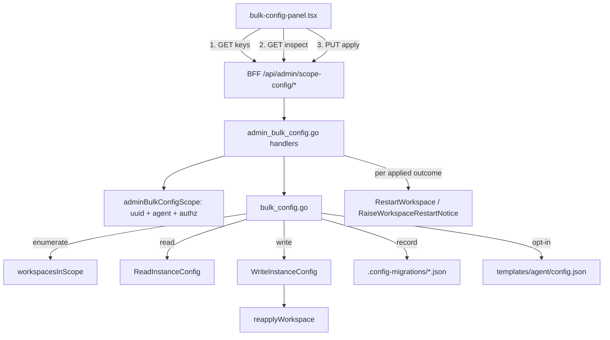

# admin-bulk-instance-config — Design

**Spec**: `.specs/features/admin-bulk-instance-config/spec.md`
**Status**: Draft
**Webapp slice**: `crab-exoskeleton-webapp/.specs/features/admin-bulk-instance-config/spec.md`

---

## Architecture Overview

Three read-mostly endpoints over one new `docker`-layer file. Nothing in the
existing write path changes: the bulk layer **composes** `ReadInstanceConfig` /
`WriteInstanceConfig` per instance and never opens `config.json` itself.



The single-instance editor (`admin-instance-config-editor`) is the load-bearing
dependency: every guarantee about atomicity, ownership, redaction round-trip and
managed-path authority is **inherited**, not restated.

> `mermaid-studio` is not installed here, so the diagram above is an inline
> block. Installing it would give rendered SVG/PNG and validation.

---

## Code Reuse Analysis

### Existing components to leverage

| Component | Location | How to use |
| --- | --- | --- |
| `workspacesInScope(Scope)` | `internal/docker/shared.go:508` | Enumerate instances. Already filters by `scope.AgentKey`; needs `Kind: ScopeSubscription` |
| `ListSubscriptionUsers` | `internal/docker/shared.go:314` | Reached through `workspacesInScope`; supplies `UserRef.Email` for the UI's member lists |
| `ReadInstanceConfig(key)` | `internal/docker/instance_config.go:95` | One read per instance: gives `Raw`, `Valid`, `ParseError`, and the on-disk `Revision` |
| `WriteInstanceConfig(key, raw, rev)` | `instance_config.go:156` | The only writer. Brings atomic temp+rename, `0o600`, `chownTree`, `unmaskAgainst`, `reapplyWorkspace` |
| `ManagedConfigPaths` | `instance_config.go:54` | The refusal list for FR-2.4. Never copied |
| `writeConfigAtomic(path, b)` | `instance_config.go:213` | Reused verbatim for the **template** write |
| `revisionOf(b)` | `instance_config.go:252` | Template revision token |
| `parseConfigObject(b)` | `instance_config.go:240` | Rejects `null`/array/scalar top levels — the case the earlier spec's reconciliation records |
| `childMap(m, key)` | `internal/docker/secrets.go:333` | Get-or-create semantics `setPath` needs |
| `containedJoin(dir, name)` | `internal/docker/paths.go:62` | The check-at-point-of-use for the record filename |
| `adminInstanceKey` | `internal/httpapi/admin_instance_config.go:43` | The **shape** to copy for `adminBulkConfigScope`: UUID parse → `resolveAgentTarget` → `AuthorizeUserManagement` |
| `bounceOrNotify(key, bounce, what)` | `internal/docker/model.go:112` | The per-workspace restart reduction DEC-8 needs. Takes `ReasonModel` today, so it needs a reason parameter or a `ReasonConfig` sibling |
| `parsePolicyFields(mode, at, note)` | `internal/httpapi/restart.go:316` | Policy parsing. Its `now` default is **shared** — DEC-9 substitutes locally, never here |
| `RestartWorkspace` / `RaiseWorkspaceRestartNotice` | `internal/docker/restart_control.go:62` | The two ends of the per-workspace delivery |
| `restart.ReasonConfig` | `internal/restart/restart.go:51` | Exists; its doc comment widens to cover a bulk change |
| `logInstanceConfigRefusal` | `admin_instance_config.go` | The refusal-audit pattern FR-5.2 requires |
| `forwardAdmin` / `proxyAdminJsonAgent` | webapp `lib/adminProxy.ts:50,94` | BFF passthrough with bearer + restart params |
| `SECTION_TABS` / `PICOCLAW_ONLY` | webapp `app/admin/tabs.ts:25`, `agent-scope.ts:32` | One-line additions; `CONTENT_TABS` derives itself |

### Integration points

| System | Integration method |
| --- | --- |
| Gateway routing | None needed — `/v1/admin/*` is already a single wildcard |
| Restart control | Per-workspace `RestartWorkspace` / `RaiseWorkspaceRestartNotice` with the existing `ReasonConfig` (DEC-8) |
| Model registry | Only indirectly: `WriteInstanceConfig`'s `reapplyWorkspace` resolves it per changed instance (spec NFR-4) |
| Admin screen | New section key; the scope rail and agent picker are untouched |

### Why not `valueAtPath`

`valueAtPath` (`instance_config.go:492`) returns `nil` for *three* different
situations: the segment is missing, a segment is not an object, and the value is
legitimately JSON `null`. `changedConfigPaths` can live with that because it only
asks "did this managed path change". This feature cannot: P1 AC-4 requires
`absent` to be a distinct bucket from `null`, and P2 AC-3 requires a non-object
traversal to be a per-instance `path_conflict`. So a tri-state sibling is added
and `valueAtPath` is left untouched.

---

## Components

### `lookupPath` / `setPath` / key validation

- **Purpose**: dotted-path access with the three outcomes the feature must tell
  apart, plus the key's own validity.
- **Location**: `internal/docker/config_path.go` (new)
- **Interfaces**:
  - `lookupPath(doc map[string]any, dotted string) (any, PathState)` — `PathFound`
    (value may be `nil`, meaning JSON `null`), `PathAbsent`, `PathConflict`
  - `setPath(doc map[string]any, dotted string, value any) error` — creates
    intermediate objects via `childMap`, never replaces a sibling;
    `ErrPathConflict` when a segment holds a non-object
  - `ValidateConfigKey(dotted string) error` — non-empty dotted segments, charset
    `A-Za-z0-9._-`, no `..`. It is stricter than JSON allows **because the key
    becomes part of a filename** (FR-4.1); a key with a `/` or `..` must never
    reach a path join
  - `IsManagedConfigPath(dotted string) bool` — the three relations of FR-2.4:
    equal to, under, or a **prefix of** a `ManagedConfigPaths` entry
- **Dependencies**: none beyond `strings`
- **Reuses**: `childMap`, `ManagedConfigPaths`

### `Manager.InspectScopeConfigKey`

- **Purpose**: the distribution of one key across one subscription's instances of
  one agent.
- **Location**: `internal/docker/bulk_config.go` (new)
- **Interfaces**:
  - `InspectScopeConfigKey(scope Scope, key string) (ScopeConfigInspection, error)`
- **Behaviour**:
  1. `ValidateConfigKey` + `IsManagedConfigPath` → `ErrInvalidConfigKey` /
     `ErrManagedConfigPath` before any filesystem access.
  2. `workspacesInScope(scope)` — with `scope.AgentKey` set, so a member holding
     two agents contributes one instance.
  3. Per instance `ReadInstanceConfig`:
     - `ErrNotProvisioned` → `unreadable`, detail `not_provisioned`
     - `!Valid` → `unreadable`, detail = `ParseError`
     - else `lookupPath` → `PathFound` (bucket by value) / `PathAbsent` /
       `PathConflict` (its own bucket: it is neither a value nor unreadable)
  4. Group by `string(json.Marshal(value))`. Go's encoder sorts object keys and
     `json.Unmarshal` normalises all numbers to `float64`, so `1` and `1.0`, and
     two objects differing only in key order, land in the same bucket — FR-2.3
     needs no custom canonicaliser.
  5. Order buckets: value buckets by descending count, then by encoded value for
     determinism; then `absent`, `path_conflict`, `unreadable`. Tests and the UI
     both need a stable order.
- **Dependencies**: `Manager.cfg.ContainerDataRoot`
- **Reuses**: `workspacesInScope`, `ReadInstanceConfig`

### `Manager.ApplyScopeConfigKey`

- **Purpose**: set one key to one value across the instances that differ, and
  leave a record in each.
- **Location**: `internal/docker/bulk_config.go`
- **Interfaces**:
  - `ApplyScopeConfigKey(scope Scope, ch ScopeConfigChange) (ScopeConfigResult, error)`
- **Per-instance algorithm** — the order is deliberate:
  1. `ReadInstanceConfig` → same `unreadable` classification as inspect. An
     unparseable document cannot be edited by path; it is skipped, not repaired
     (that is the single-instance editor's job).
  2. Revision gate: `ch.Revisions[userAccID]` absent **or** different from
     `cfg.Revision` → `stale`. Absent means the instance was provisioned after
     the admin's inspect — never write to an instance the admin did not see
     (FR-3.4).
  3. Parse `cfg.Raw` — deliberately the **redacted** string, not a fresh
     `os.ReadFile`. Pairing it with `WriteInstanceConfig` keeps the inherited
     `unmaskAgainst` restore on the path it was designed for; a raw read would
     bypass the mask and work by accident rather than by contract.
  4. `lookupPath` → `PathConflict` → `path_conflict`; `PathFound` and
     canonically equal to the target → `unchanged` (no write, no record, no
     restart participation).
  5. `setPath` → `json.MarshalIndent(doc, "", "  ")` → `WriteInstanceConfig(key,
     raw, cfg.Revision)`. The indent matches what `materializeModels` already
     writes, so the file stays in the shape the proxy produces elsewhere.
  6. Write the migration record (below). A record failure leaves the outcome
     `applied` and adds `recordError` — P3 AC-6.
  7. Carry `WriteInstanceConfig`'s `ReapplyResult` into the outcome, so an
     instance whose registry no longer resolves is visible rather than silent.
- **Never**: a transaction across instances. There is none to have; DEC-7's
  per-instance outcomes are the honest report.
- **Reuses**: `ReadInstanceConfig`, `WriteInstanceConfig`, `lookupPath`,
  `setPath`

### `writeConfigMigration`

- **Purpose**: the `from`/`to` record, in the member's own environment.
- **Location**: `internal/docker/bulk_config.go`
- **Interfaces**:
  - `writeConfigMigration(dir string, rec ConfigMigration) (string, error)` —
    returns the filename written
- **Behaviour**:
  - `dir` is `<userDir>/.config-migrations` (a sibling of `workspace/`), created
    `0o700`, files `0o600`, **proxy-owned — no chown** (spec FR-4.1, amended
    during T3). The signature therefore takes no `user`:
    `writeConfigMigration(dir string, rec ConfigMigration) (string, error)`.
  - Filename `<yyyymmdd>T<hhmmss>Z-<key>.json`. Collision → `-2`, `-3`, … via
    `os.OpenFile(..., O_CREATE|O_EXCL)` retry (FR-4.1a). Second resolution keeps
    the name readable; the retry is what makes accumulation a guarantee.
  - `key` is already filename-safe by `ValidateConfigKey`; the join is still done
    through the existing `containedJoin` so the check exists at the point of use,
    the way `writeFileSecret` does it.
- **Reuses**: `containedJoin` (`paths.go:62`). **Not** `chownTree` — see above.

### `Manager.ApplyTemplateConfigKey`

- **Purpose**: the opt-in durable half — future members inherit the change.
- **Location**: `internal/docker/bulk_config.go`
- **Interfaces**:
  - `TemplateConfigKeys(template string) (TemplateCatalog, error)` — flattened leaf
    paths + values + `managed` flags + `revision`
  - `ApplyTemplateConfigKey(template, key string, value any, revision, by string, at time.Time) (TemplateResult, error)`

  Both take a template NAME, not an agent key: `template` is a config.yaml field
  two agents may share, so passing the key would address the wrong directory or
  none. The handler resolves it via `s.Cfg.Agents[key].Template`.
- **Behaviour**:
  - Path `config.TemplatesDir(root, agent)/config.json`. Read → `lookupPath` →
    `setPath` → `writeConfigAtomic`.
  - **No `chownTree`.** The templates tree is not bind-mounted into any container
    (`docker inspect` on a running instance shows mounts for the user workspace,
    shared dirs and managed skills only), so there is no container user to grant
    access to. Stating this prevents a later reader from "fixing" the omission.
  - **No `reapplyWorkspace`.** A template is not a workspace; materialization is
    what happens to a workspace when it is provisioned from this file.
  - Revision-checked like an instance: `TemplateConfigKeys` returns
    `templateRevision`, and `alsoTemplate` requires it. Cheap, and it closes the
    only remaining blind write in the feature.
  - Its own migration record under `templates/<template>/.config-migrations/`.
- **Reuses**: `config.TemplatesDir`, `parseConfigObject`, `writeConfigAtomic`,
  `revisionOf`, `writeConfigMigration`

### `adminBulkConfigScope` + three handlers

- **Purpose**: parameter validation, authorization, audit, restart delivery.
- **Location**: `internal/httpapi/admin_bulk_config.go` (new)
- **Interfaces**:
  - `adminBulkConfigScope(w, r, ident) (docker.Scope, bool)`
  - `handleAdminScopeConfigKeys`, `handleAdminScopeConfigInspect`,
    `handleAdminScopeConfigPut`
- **Behaviour**:
  - Modelled on `adminInstanceKey`, **not** on `adminScope`. `adminScope` accepts
    `scope=tenant|subscription`; this feature requires `tenant_id`, `subs_acc_id`
    and `agent`, and offers no `scope` parameter at all. DEC-1's ceiling is
    therefore enforced by *there being no tenant form of the request* rather than
    by rejecting one.
  - `AuthorizeUserManagement(profile, tenantID, subsAccID)` — FR-6.1. No extra
    tier for `alsoTemplate` (DEC-4).
  - Restart policy parsed **before** the apply (the established "validate first"
    order) and delivered after, **per changed workspace** — DEC-8:
    ```go
    // bulkRestartMode defaults an ABSENT restart parameter to notice for this
    // endpoint only (DEC-9). parsePolicyFields defaults to now and is shared by
    // every sibling; substituting here rather than there is what keeps their
    // default intact.
    mode := r.URL.Query().Get("restart")
    if mode == "" { mode = PolicyNotice }
    p, err := parsePolicyFields(mode, q.Get("restart_at"), q.Get("restart_note"))
    …
    for _, o := range result.Outcomes {
        if o.Outcome != "applied" { continue }   // DEC-8: only what changed
        s.Mgr.bounceOrNotifyConfig(keyFor(o), p.Mode == PolicyNow)
    }
    ```
    `applyRestartPolicy` is **not** used: `BounceScope` filters by container label
    and would restart every running instance of the agent in the subscription,
    including the ones reported `unchanged`/`stale`/`unreadable`, and it also runs
    `PropagateScope` (secrets sync) that a config change does not need. The
    per-workspace reduction is what `model.go:112`'s `bounceOrNotify` already does
    for exactly this reason.
  - `schedule` degrades to `notice`, as it does at every per-workspace site.
  - Audit: one line per apply with caller, scope, agent, key, outcome counts and
    `alsoTemplate`; one **separate** line for a template write (FR-5.3); refusals
    logged from the refusal branches, the gap the earlier feature's
    reconciliation records.
  - **Never the value.** A hand-typed path could address a credential-bearing
    field, so the log carries the key and never the payload (FR-5.1).
- **Routes** (`internal/httpapi/handlers.go`, next to lines 268-269):
  ```go
  mux.HandleFunc("GET /v1/admin/scope/config/keys",    s.handleAdminScopeConfigKeys)
  mux.HandleFunc("GET /v1/admin/scope/config/inspect", s.handleAdminScopeConfigInspect)
  mux.HandleFunc("PUT /v1/admin/scope/config",         s.handleAdminScopeConfigPut)
  ```

---

## Data Models

### Go — inspect

```go
type PathState int
const (
    PathFound PathState = iota // resolves; the value may be JSON null
    PathAbsent                 // a segment is missing
    PathConflict               // a segment holds a non-object
)

// BucketState is why an instance is in a bucket. "value" carries Value; the
// other three carry Detail and no value.
type BucketState string
const (
    BucketValue      BucketState = "value"
    BucketAbsent     BucketState = "absent"
    BucketConflict   BucketState = "path_conflict"
    BucketUnreadable BucketState = "unreadable"
)

type ConfigKeyInstance struct {
    UserAccID string `json:"userAccId"`
    Email     string `json:"email,omitempty"`
    Revision  string `json:"revision"`
    Detail    string `json:"detail,omitempty"` // parse error, not_provisioned, conflicting segment
}

type ConfigKeyBucket struct {
    State     BucketState         `json:"state"`
    Value     json.RawMessage     `json:"value,omitempty"` // only when State == BucketValue
    Count     int                 `json:"count"`
    Instances []ConfigKeyInstance `json:"instances"`
}

type ScopeConfigInspection struct {
    Key     string            `json:"key"`
    Agent   string            `json:"agent"`
    Total   int               `json:"total"`
    Buckets []ConfigKeyBucket `json:"buckets"`
}
```

**No `Template` field** (amended during T2). The first draft carried the
template's value here for reference, but `TemplateConfigKeys` already returns a
value for every key in the catalog, so the panel has it before it ever inspects.
Reading the template a second time per inspect bought nothing.

### Go — apply

```go
type ScopeConfigChange struct {
    Key   string          `json:"key"`
    Value json.RawMessage `json:"value"` // verbatim: true and "true" are different requests
    // Revisions is keyed by userAccId — unique within one subscription+agent,
    // which the query parameters already fix. No composite key.
    Revisions        map[string]string `json:"revisions"`
    AlsoTemplate     bool              `json:"alsoTemplate,omitempty"`
    TemplateRevision string            `json:"templateRevision,omitempty"`
}

type InstanceOutcome struct {
    UserAccID string         `json:"userAccId"`
    Email     string         `json:"email,omitempty"`
    Outcome   string         `json:"outcome"` // applied|unchanged|stale|path_conflict|unreadable|error
    Detail    string         `json:"detail,omitempty"`
    Migration string         `json:"migration,omitempty"`
    RecordErr string         `json:"recordError,omitempty"`
    Reapplied *ReapplyResult `json:"reapplied,omitempty"`
}

type TemplateResult struct {
    OK        bool   `json:"ok"`
    Detail    string `json:"detail,omitempty"`
    Migration string `json:"migration,omitempty"`
}

type ScopeConfigResult struct {
    Key      string            `json:"key"`
    Outcomes []InstanceOutcome `json:"outcomes"`
    Summary  map[string]int    `json:"summary"` // outcome -> count
    Template *TemplateResult   `json:"template,omitempty"`
}
```

### On disk — the migration record

`<userDir>/.config-migrations/20260731T134502Z-tools.web.brave.enabled.json`

```json
{
  "key": "tools.web.brave.enabled",
  "from": false,
  "to": true,
  "appliedAt": "2026-07-31T13:45:02Z",
  "by": "samuel.elias@biotrop.com.br",
  "scope": { "tenantId": "…", "subsAccId": "…", "agent": "alpha" },
  "revisionBefore": "sha256:…",
  "revisionAfter": "sha256:…"
}
```

```go
type ConfigMigration struct {
    Key string `json:"key"`
    // From is omitted and FromAbsent set when the key did not exist, so a revert
    // deletes it instead of writing a literal null — which is a legal value.
    From       json.RawMessage `json:"from,omitempty"`
    FromAbsent bool            `json:"fromAbsent,omitempty"`
    To         json.RawMessage `json:"to"`
    AppliedAt  time.Time       `json:"appliedAt"`
    By         string          `json:"by"`
    Scope      struct {
        TenantID  string `json:"tenantId"`
        SubsAccID string `json:"subsAccId"`
        Agent     string `json:"agent"`
    } `json:"scope"`
    RevisionBefore string `json:"revisionBefore"`
    RevisionAfter  string `json:"revisionAfter"`
}
```

**Not an audit log** (DEC-5). The directory is inside a mount the container can
write, so a compromised agent could alter it; FR-5's proxy log is the authority.
This sentence belongs in the file's doc comment.

### TypeScript — webapp

```ts
export type BucketState = "value" | "absent" | "path_conflict" | "unreadable";

export interface ConfigKeyInstance {
  userAccId: string;
  email?: string;
  revision: string;
  detail?: string;
}
export interface ConfigKeyBucket {
  state: BucketState;
  value?: unknown;
  count: number;
  instances: ConfigKeyInstance[];
}
export interface ScopeConfigInspection {
  key: string;
  agent: string;
  total: number;
  buckets: ConfigKeyBucket[];
  // no template field — the catalog already carries the template's value
}
export interface TemplateKey {
  key: string;
  value: unknown;
  managed: boolean;
}
export interface TemplateCatalog {
  template: string;
  keys: TemplateKey[];
  templateRevision: string;
}
```

---

## Error Handling Strategy

| Scenario | Handling | Admin sees |
| --- | --- | --- |
| `key` malformed / contains `..` or `/` | `400 invalid_key`, before any FS access | Inline error on the key field |
| `key` is/under/prefix-of a managed path | `400 managed_path` on both verbs | "This key is owned by the proxy", with the path list from `managedPaths` |
| Caller below `TierSubscription` | `403`, logged from the refusal branch | Section not offered; a direct call is refused |
| Instance `config.json` absent | Bucket/outcome `unreadable`, detail `not_provisioned` | Listed apart, never counted as a value |
| Instance `config.json` unparseable | Same, detail = parse error | Listed apart; the single-instance editor is the fix, and the UI links to it |
| Segment traverses a non-object | Bucket/outcome `path_conflict` for that instance only | Named in the result; the rest applied |
| Revision stale or missing | Outcome `stale`, nothing written | "Re-inspect: N instances changed since you looked" |
| `reapplyWorkspace` fails after write | `reapplied.ok:false` in the outcome; write stands | Warning per instance, not a failed save |
| Migration record write fails | Outcome stays `applied`, `recordError` set, logged | Warning that recovery data is missing for that instance |
| Template revision stale | `template.ok:false`; instance outcomes stand | "Template unchanged — reload and retry" |
| Body over 256 KiB | `413 too_large` via `io.LimitReader` | Cannot occur from the UI |
| Zero instances in scope | `200` with empty buckets | "No provisioned instances of this agent here" |

---

## Tech Decisions

| Decision | Choice | Rationale |
| --- | --- | --- |
| Path access | New tri-state `lookupPath`, `valueAtPath` untouched | `valueAtPath` conflates absent / non-object / `null`; P1 AC-4 and P2 AC-3 need all three apart |
| Writer | Compose `WriteInstanceConfig` per instance | Inherits atomicity, chown, unmask and managed-path authority. Cost is N materializations (spec NFR-4), accepted |
| Which bytes to edit | Parse `cfg.Raw` (redacted), not a fresh read | Keeps the inherited `unmaskAgainst` restore on its designed path instead of bypassing it by luck |
| Canonical value compare | `json.Marshal` of the unmarshalled value | Go sorts object keys and normalises numbers to `float64`; FR-2.3 needs no custom code |
| Scope parsing | Copy `adminInstanceKey`, not `adminScope` | No `scope` parameter means no tenant form of the request to reject — DEC-1 by construction |
| Key charset | Stricter than JSON permits | The key becomes part of a filename (FR-4.1) |
| Template write | Revision-checked, no chown, no reapply | It is proxy-owned and unmounted; a workspace's rules do not apply to it |
| Bucket ordering | Count desc, then encoded value; non-value buckets last | Stable output for tests and a UI that must not reshuffle between reads |
| Batch semantics | Per-instance outcomes, always `200` | Mirrors `PropagateScope`; one corrupt member must not block 49 others |
| Restart target | Iterate `applied` outcomes, per-workspace | `BounceScope` filters by label and cannot know which instances changed — DEC-8 |
| Restart default | `notice`, substituted locally | The shared `parsePolicyFields` default stays `now` for every sibling — DEC-9 |

---

## Concerns Carried From The Spec

- **FR-6.4** — `config.json` holds the agent's sandbox boundary, and this
  endpoint reaches N of them at once. The handler comment must say so, and FR-5's
  audit is what makes it reconstructable. Same accepted tier as the
  single-instance editor (its DEC-3).
- **DEC-4** — `alsoTemplate` crosses subscriptions **and agents sharing a
  template** by design; the control is the
  UI sentence (FR-7.4) plus the separate log line, not authority.
- **`.specs/codebase/CONCERNS.md` does not exist in this repo**, so there is no
  fragility register to check against. Flagged rather than silently skipped.

---

## Verification Strategy

Unit tests in `internal/docker` and `internal/httpapi`, one per traceability ID.
The ones that would otherwise be missed:

- `TestBulkConfigRefusesManagedPathPrefix` — `agents` refused, not only
  `agents.defaults.provider`
- `TestInspectSeparatesAbsentFromNull` — a workspace with `"k": null` and one
  without land in different buckets
- `TestApplySkipsInstanceMissingFromRevisions` — provisioned-since is `stale`
- `TestApplyWritesThroughWriteInstanceConfig` — NFR-3's gate against a second
  writer appearing
- `TestMigrationRecordsAccumulateWithinOneSecond` — the `O_EXCL` retry
- `TestApplyNeverLogsTheValue` — FR-5.1
- `TestTemplateWriteIsNotChownedOrReapplied` — pins the two deliberate omissions

The nine root-requiring failures in `internal/docker` (all `lchown … operation
not permitted`) are pre-existing on a clean HEAD; new tests must pass in a
non-root environment, so they use `PicoclawUser: ""` the way
`TestApplyNativeSecretsPreservesSiblings` already does.
